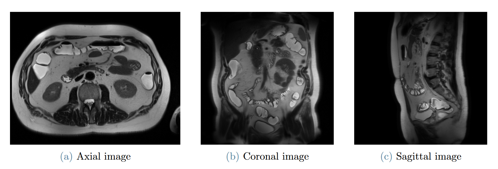
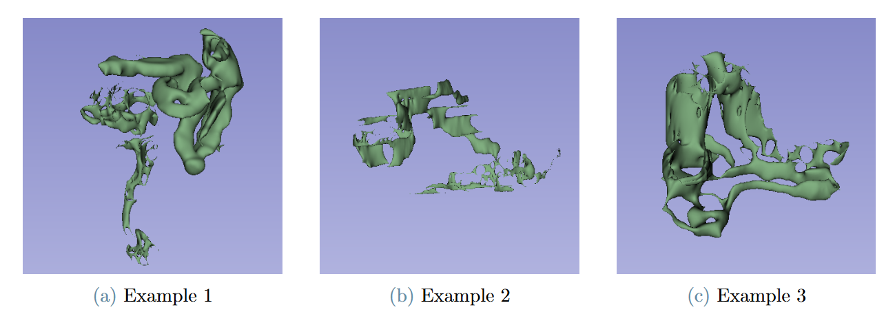
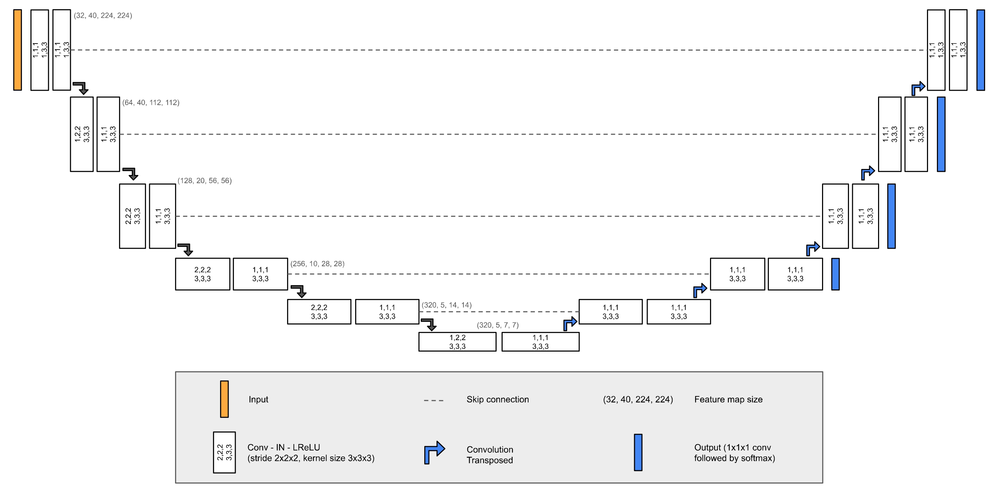
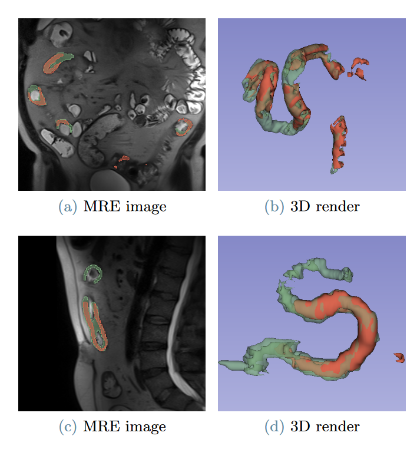

# Development of Deep Learning-based Algorithm for Segmentation of Bowel Lesions in Crohn’s Disease Patients on MRE

For more details refer to the Thesis [Executive Summary](2024_04_Cazzolla_Executive_Summary.pdf)

## Introduction
Crohn’s disease (CD) is a type of inflammatory bowel disease characterized by transmural inflammation and skip lesions within the intestinal walls.

  

Computed tomography enterography (CTE) and Magnetic Resonance Enterography (MRE), have emerged as the standards for assessing the
small intestine. 

While existing research has predominantly focused on applying deep learning to CTE images, there remains a notable gap in its application
to MRE segmentation for CD.

  

The purpose of this work is to develop a deep learning automatic segmentation model for Crohn’s Disease detection from MRE images.

## Methods

### Dataset
Dataset consisted of 60 patients. Each had available an axial, coronal and sagittal 2D volumetric T2 weighted HASTE MRI image.

  

### Labels
The target of the segmentation consist on the bowel wall of the disease-affected portions of the gastrointestinal tract.

  

### nnU-Net
[nnU-Net](https://github.com/MIC-DKFZ/nnUNet) was used as segmentation model. Three model were trained, one for each dataset.

  

The model were trained on a Nvidia RTX 3090, with a total training time of 6 days.

## Results

  

| Dataset           |  Dice Score      | Dilated Dice Score     |
|:----------------------:|:-------------------:|:-------------------:|
| Axial                        | 0.323 $\pm$ 0.286 | 0.413 $\pm$ 0.330 |
| Coronal                             | 0.279 $\pm$ 0.272 | 0.384 $\pm$ 0.339 |
| Sagittal                               | 0.295 $\pm$ 0.284 | 0.397 $\pm$ 0.364 |

