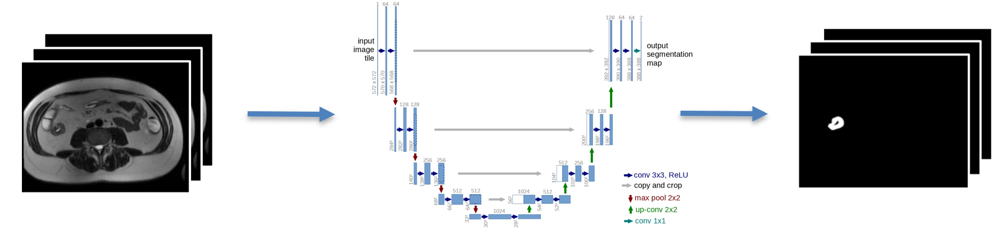

# Development of Deep Learning-based Algorithm for Segmentation of Bowel Lesions in Crohn’s Disease Patients on MRE

For a detailed overview, please refer to the Thesis [Executive Summary](2024_04_Cazzolla_Executive_Summary.pdf)

## Introduction
Crohn’s disease (CD) is a type of inflammatory bowel disease characterized by transmural inflammation and skip lesions within the intestinal walls.

  

Computed tomography enterography (CTE) and Magnetic Resonance Enterography (MRE), have emerged as the standards for assessing the
small intestine. 

While existing research has predominantly focused on applying deep learning to CTE images, there remains a notable gap in its application
to MRE segmentation for CD.

  

The purpose of this work was to develop a deep learning automatic segmentation model for Crohn’s Disease detection from MRE images.

## Methods

### Dataset
The dataset comprises MRI images from 60 CD patients, each including axial, coronal, and sagittal 2D volumetric T2-weighted HASTE sequences.

  

These images were generously provided by [Humanitas Research Hospital](https://www.humanitas.it/), a specialized center for CD research and treatment.

### Labels
The target of the segmentation consist on the bowel wall of the disease-affected portions of the gastrointestinal tract.

  

The labels were manually segmented by a Junior Radiologist at Humanitas Research Hospital.

### nnU-Net
We employed the [nnU-Net](https://github.com/MIC-DKFZ/nnUNet) model for segmentation. Three models were trained, each corresponding to a specific dataset (aligned with the anatomical plane of reference).

  

The models were trained on a Nvidia RTX 3090, with a total training time of 6 days.

## Results
Model performance was evaluated using Dice and Dilated Dice coefficients (further details in the executive summary).

|Dataset           |Dice Score         |Dilated Dice Score |
|:----------------:|:-----------------:|:-----------------:|
|Axial             | 0.323 $\pm$ 0.286 | 0.413 $\pm$ 0.330 |
|Coronal           | 0.279 $\pm$ 0.272 | 0.384 $\pm$ 0.339 |
|Sagittal          | 0.295 $\pm$ 0.284 | 0.397 $\pm$ 0.364 |

Results indicate variable performance, with the models achieving high segmentation accuracy in some patients while encountering challenges in others, particularly those with smaller lesion sizes.

Moreover, an intriguing finding was the models' ability to detect disease regions overlooked by the junior radiologist during manual segmentation, underscoring the potential utility of this technology for assisting less-experienced radiologists

  

